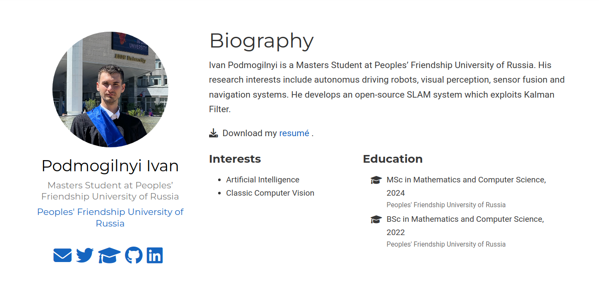
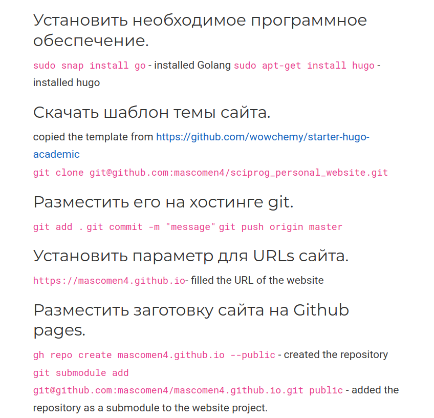
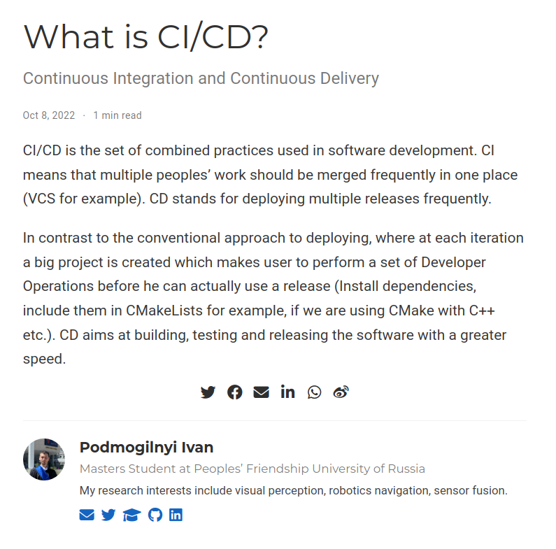

## Цель работы

Выполнить вторую часть

## Задание

1. Разместить фотографию владельца сайта
2. Разместить краткое описание владельца сайта (Biography)
3. Добавить информацию об интересах (Interests)
4. Добавить информацию об образовании (Education)
5. Сделать пост о прошедней неделе
6. Добавить пост про непрерывную интеграцию и непрерывное развертывание (CI/CD)

## Выполнение лабораторной работы

### Список добавляемых данных.
1. Разместить фотографию владельца сайта.
2. Разместить краткое описание владельца сайта (Biography).
3. Добавить информацию об интересах (Interests).
4. Добавить информацию от образовании (Education).

### Сделать пост по прошедшей неделе:

### Добавить пост на тему непрерывная интеграция и непрерывное развертывание (CI/CD):

# Выводы

Добавил к сайту данные о себе.
