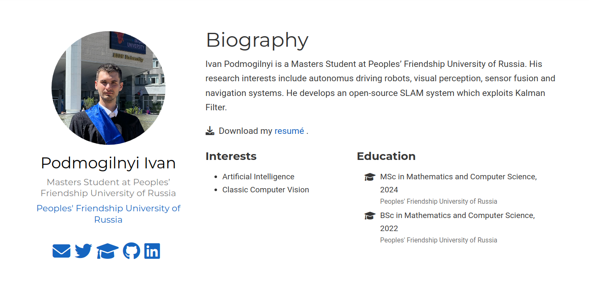

## Цель работы

Выполнить пятую часть

## Задание

1. Сделать поддержку английского и русского языков.
2. Разместить элементы сайта на обоих языках.
3. Разместить контент на обоих языках.
4. Сделать пост по прошедшей неделе.
5. Добавить пост на тему по выбору (на двух языках).
Языки научного программирования.

## Выполнение лабораторной работы

### Список добавляемых данных.
1. Сделать поддержку английского и русского языков.
2. Разместить элементы сайта на обоих языках.
3. Разместить контент на обоих языках.
4. Сделать пост по прошедшей неделе.
5. Добавить пост на тему по выбору (на двух языках).
Языки научного программирования.

### Сделать пост по прошедшей неделе:

### Добавить пост на тему Языки научного программирования:

# Выводы

Сделал сайт двуязычным
